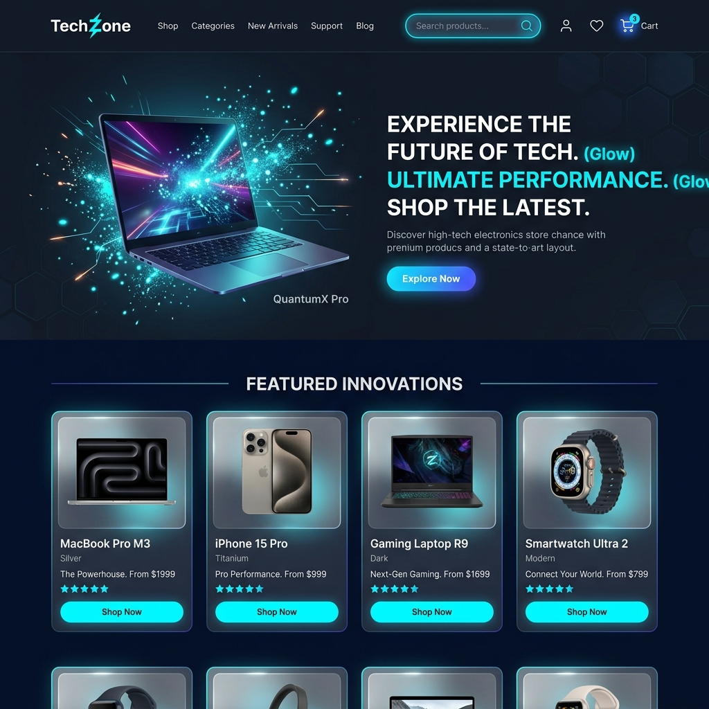
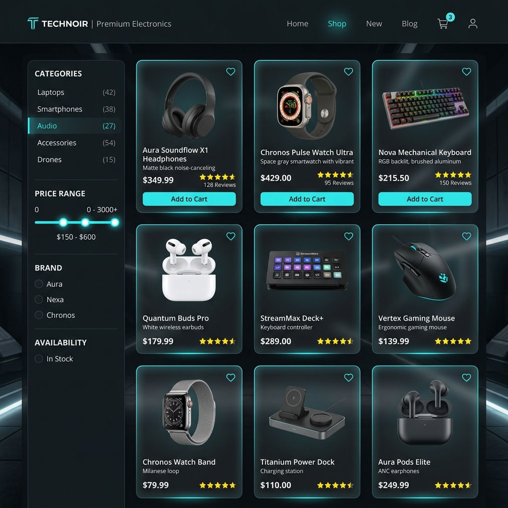
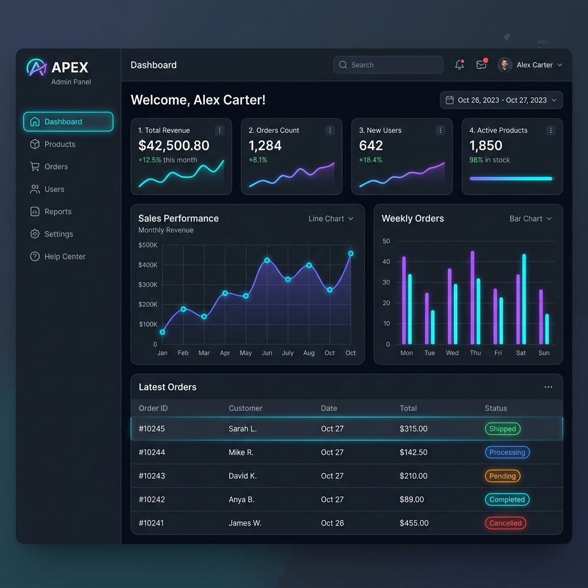

# ⚡ TechZone — Premium MERN E-Commerce Platform

TechZone is a production-grade, full-stack e-commerce web application built using the MERN stack (MongoDB, Express, React, Node.js). Featuring a premium dark-theme UI with sleek glassmorphism design, real-time order tracking notifications using Socket.io, secure authentication via HTTP-only cookies, robust product filters, and payment processing, it offers an end-to-end shopping experience for customers and a complete analytics-driven admin panel for store operators.

---

## 📸 Screenshots

### 🖥️ Customer Homepage
*A sleek, custom dark interface displaying featured products, rotating promotional banners, and clean navigation.*


### 🛍️ Product Catalog
*Interactive filtering by category, brand, rating, and price range, with modern grid layouts and glowing star ratings.*


### 📊 Admin Panel Dashboard
*Real-time charts, total revenue stats, order statuses, and direct product/user management operations.*


---

## ✨ Features

### 🛍️ Customer Operations
- **Sleek Browse & Advanced Filters** — Search by keyboard keywords (with built-in pluralization and synonym support e.g. "mice" matching "mouse"), filter by categories, brands, price range, ratings, and sort by price, rating, or newest.
- **Detailed Specifications** — Interactive product pages complete with responsive image views, dynamic specifications tables, and verified purchase reviews with star ratings.
- **Smart Cart System** — Interactive quantity adjustments, real-time subtotal estimations, and dynamic discount calculations using promotional coupon codes (`TECH10`, `SAVE20`, `WELCOME15`).
- **Flexible Checkout** — Multi-step shipping information forms with Stripe Card payments or Cash on Delivery (COD) mode fallback.
- **Real-Time Order Tracker** — Visual tracking bar showing progression statuses: `Pending` ➔ `Processing` ➔ `Shipped` ➔ `Delivered`.
- **Persistent Wishlist** — Save products to your account and review them later.
- **Secure Authentication** — JWT auth saved securely via client-side HTTP-only cookies to mitigate XSS vulnerabilities.

### 👨‍💼 Admin Features
- **Analytics Dashboard** — Dynamic charts tracking total store sales, revenue calculations, and order volumes.
- **Product Inventory Management (CRUD)** — Create, edit, and delete products including custom specification mapping and inventory control.
- **Order Processing** — Monitor all user orders, update tracking numbers, and advance shipment status (triggers real-time client status updates).
- **User Role Management** — View all registered accounts, elevate standard users to administrative status, or delete accounts.

---

## 📁 Repository Structure

The project has been refactored to support a single configuration file at the root, making startup and deployment easy.

```
techzone/
├── .env                     # [Git-ignored] Unified configuration keys
├── .env.example             # Template file showing required environment keys
├── .gitignore               # Configured git rules ignoring node_modules, local keys, logs, uploads
├── package.json             # Root npm configuration with concurrent scripts
├── start.bat                # Windows startup batch script
│
├── client/                  # Frontend project (React 18 + Vite)
│   ├── vite.config.js       # Configured with proxy and envDir pointing to root
│   ├── src/
│   │   ├── components/      # Shared components (Navbar, Footer, Route Guards)
│   │   ├── pages/           # Client views (Cart, Checkout, Profile, Admin)
│   │   └── redux/           # Store configure and RTK Query endpoints
│   
└── server/                  # Backend REST API (Express.js + Mongoose)
    ├── server.js            # Node backend server entry point (configures Socket.io)
    ├── seed.js              # Database seed script for products/admin user
    ├── models/              # Mongoose DB schemas (User, Product, Order)
    ├── controllers/         # Endpoint logic controllers
    └── routes/              # Express Router mapping
```

---

## ⚙️ Quick Start Guide

Follow these steps to set up, install, and run TechZone on your local system.

### Prerequisites
- **Node.js** (v18.0.0 or higher recommended)
- **npm** (v9.0.0 or higher)
- **MongoDB** (local installation running on port `27017` or a MongoDB Atlas cloud URI)

---

### Step 1: Clone the Repository
Clone the repository using Git and navigate to the root directory:
```bash
git clone https://github.com/your-username/techzone.git
cd techzone
```

---

### Step 2: Configure Environment Keys
Create a `.env` file in the project's root folder. You can copy the template provided:
```bash
cp .env.example .env
```

Open **[.env](file:///c:/Users/abhuz/OneDrive/Desktop/new%20project/techzone/.env)** and configure the variables:

```env
# Port the Express server listens on
PORT=5000

# Environment mode (development/production)
NODE_ENV=development

# Database connection string (Change to your Atlas URI if not using local database)
MONGO_URI=mongodb://127.0.0.1:27017/techzone

# JWT secret used to sign user auth tokens
JWT_SECRET=supersecret_jwt_key_12345
JWT_EXPIRE=30d

# Client address for CORS settings
CLIENT_URL=http://localhost:5173

# Optional Stripe Secret Key (Omit to use fallback Cash on Delivery mode)
STRIPE_SECRET_KEY=sk_test_your_stripe_secret_key

# React Client API address (Point to backend server /api)
VITE_API_URL=http://localhost:5000/api

# Optional Stripe Publishable Key (Matches STRIPE_SECRET_KEY)
VITE_STRIPE_PUBLISHABLE_KEY=pk_test_your_stripe_publishable_key
```

---

### Step 3: Install All Dependencies
Install the required node packages for the root, backend server, and frontend client concurrently by running:
```bash
npm run install-all
```

---

### Step 4: Seed the Database
Populate the database with sample products and a default admin account:
```bash
npm run seed --prefix server
```

After seeding, you can log in as an administrator using the following credentials:
*   **Email:** `admin@techzone.com`
*   **Password:** `admin123`

---

### Step 5: Start the Application
Run the startup command to launch local MongoDB (if on Windows and installed under the default directory), the Express API server, and the Vite client application together:
```bash
npm run dev
```

*Or, if you are running on Windows, you can double-click or run the batch script:*
```bash
./start.bat
```

*   **Client Access:** Open [http://localhost:5173](http://localhost:5173) in your web browser.
*   **Backend Server URL:** [http://localhost:5000/api](http://localhost:5000/api)

---

## 📡 API Endpoints Documentation

### 🔐 Authentication & Profile — [authRoutes.js](file:///c:/Users/abhuz/OneDrive/Desktop/new%20project/techzone/server/routes/authRoutes.js)
| Method | Endpoint | Description | Auth Required |
|--------|----------|-------------|---------------|
| `POST` | `/api/auth/register` | Register a new user | Public |
| `POST` | `/api/auth/login` | Login and set auth cookie | Public |
| `POST` | `/api/auth/logout` | Clear cookie session | Public |
| `GET`  | `/api/auth/me` | Fetch active user profile | User |
| `PUT`  | `/api/auth/update-profile` | Update profile information | User |
| `PUT`  | `/api/auth/change-password` | Update account password | User |
| `POST` | `/api/auth/wishlist/:productId` | Toggle product in/out of wishlist | User |
| `GET`  | `/api/auth/cart` | Get current user's synced cart | User |
| `PUT`  | `/api/auth/cart` | Synchronize client cart state | User |

### 🛍️ Products — [productRoutes.js](file:///c:/Users/abhuz/OneDrive/Desktop/new%20project/techzone/server/routes/productRoutes.js)
| Method | Endpoint | Description | Auth Required |
|--------|----------|-------------|---------------|
| `GET`  | `/api/products` | Query products with filters | Public |
| `GET`  | `/api/products/homepage` | Get featured, new, and sale groups | Public |
| `GET`  | `/api/products/categories` | Get category list with counts | Public |
| `GET`  | `/api/products/:id` | Get specific product details | Public |
| `POST` | `/api/products/:id/reviews` | Write/update a product review | User |
| `POST` | `/api/products` | Create a new product | Admin |
| `PUT`  | `/api/products/:id` | Update product details | Admin |
| `DELETE`| `/api/products/:id` | Delete product from database | Admin |

### 📦 Orders — [orderRoutes.js](file:///c:/Users/abhuz/OneDrive/Desktop/new%20project/techzone/server/routes/orderRoutes.js)
| Method | Endpoint | Description | Auth Required |
|--------|----------|-------------|---------------|
| `POST` | `/api/orders` | Place a new order (stock decremented) | User |
| `GET`  | `/api/orders/my` | View purchase history | User |
| `GET`  | `/api/orders/:id` | Retrieve detailed order ticket | User / Admin |
| `GET`  | `/api/orders` | List all orders with stats | Admin |
| `PUT`  | `/api/orders/:id/status` | Update delivery tracking status | Admin |

### 👥 Users Management — [userRoutes.js](file:///c:/Users/abhuz/OneDrive/Desktop/new%20project/techzone/server/routes/userRoutes.js)
| Method | Endpoint | Description | Auth Required |
|--------|----------|-------------|---------------|
| `GET`  | `/api/users` | List accounts (paginated) | Admin |
| `GET`  | `/api/users/:id` | View profile details | Admin |
| `PUT`  | `/api/users/:id` | Elevate/demote user roles | Admin |
| `DELETE`| `/api/users/:id` | Terminate user account | Admin |

---

## 🎭 Promotional Demo Coupons
Enter these discount codes at checkout to apply savings:
- **`TECH10`** — 10% Off
- **`SAVE20`** — 20% Off
- **`WELCOME15`** — 15% Off

---

## 🔧 Troubleshooting

### Local MongoDB Startup Fails
If running `npm run dev` yields database connection errors:
1. Make sure your local MongoDB service is running:
   ```cmd
   net start MongoDB
   ```
2. If using a custom directory layout, ensure the `C:\data\db` directory exists on Windows, or update the `MONGO_URI` in `.env` to point to a MongoDB Atlas cluster instead.

### Stripe Mode Warning
If Stripe credentials are not specified, the client shows warning toast notifications but falls back to Cash on Delivery checkout mode cleanly, allowing you to run the order lifecycle end-to-end without payment keys.

---

## 📄 License
This project is licensed under the MIT License - see the LICENSE file for details.
